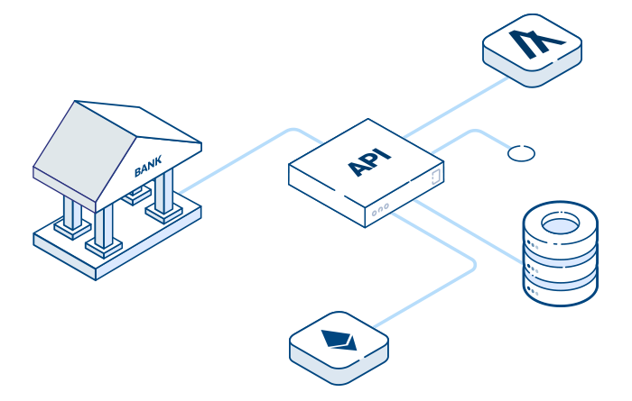
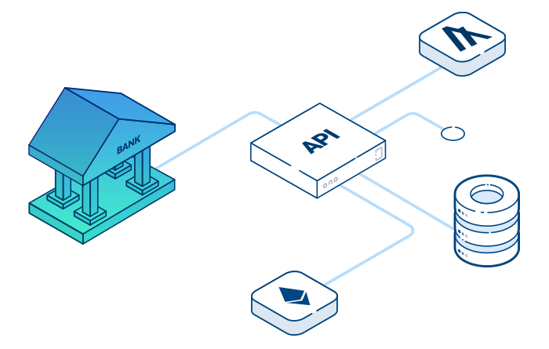
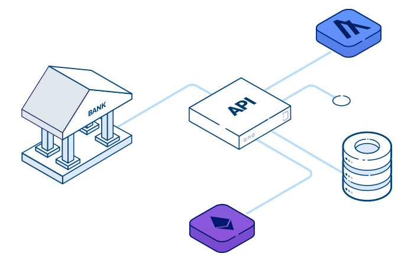
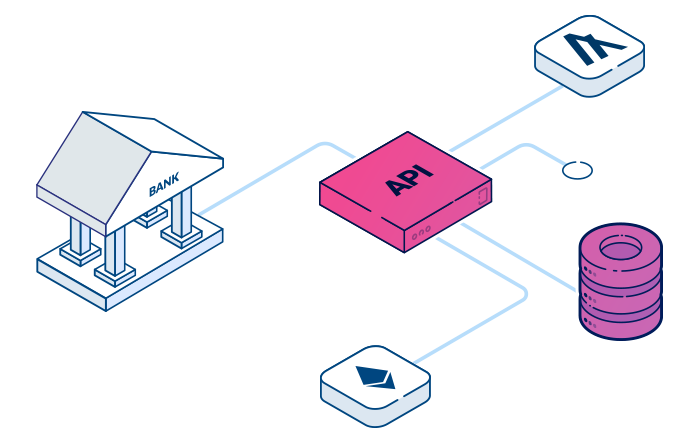
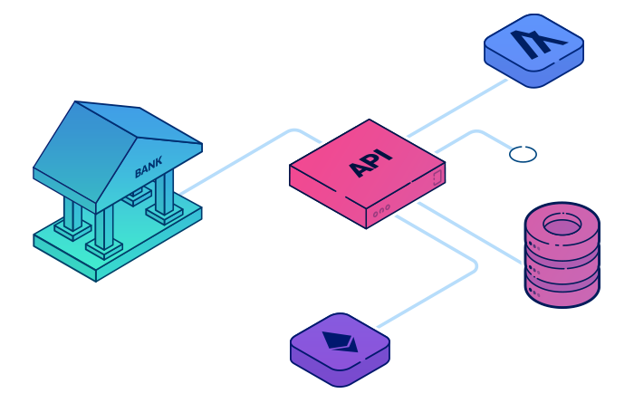
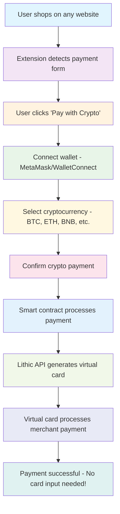

# PayperPlane - Universal Crypto Payment Solution

## 🚀 The Vision

PayperPlane is a revolutionary browser extension that bridges the gap between cryptocurrency holders and traditional e-commerce platforms. It enables users to pay with crypto on ANY website that accepts card payments - even if the merchant doesn't support cryptocurrency.

### The Problem We Solve
- **85% of online merchants** don't accept cryptocurrency payments
- **Crypto holders** want to spend their assets without selling first
- **Card input friction** - Users must manually enter card details every time
- **Privacy invasion** - Sharing sensitive financial data with every merchant
- **Complex setup** - Users need to create and fund traditional payment methods


*The frustration of traditional card payments vs. the ease of crypto payments with PayperPlane*

### Our Solution
A seamless browser extension that:
- **Replaces card input** - No more typing card numbers, expiry dates, or CVV
- **One-click crypto payments** - Simply send crypto through the plugin
- **Privacy first** - No financial data shared with merchants
- **No card management** - Users don't need to create or fund traditional cards
- **Works everywhere** - No merchant integration required

## 📸 How PayperPlane Works

<div align="center">

### The PayperPlane Journey

| **Step 1: Extension Off** | **Step 2: Traditional Banking** | **Step 3: Blockchain Integration** |
|:---:|:---:|:---:|
|  |  |  |
| *Extension detects payment forms* | *Traditional banking limitations* | *Blockchain-powered solution* |

| **Step 4: API Integration** | **Step 5: Seamless Payment** |
|:---:|:---:|
|  |  |
| *Smart contract & API integration* | *Crypto payment successful* |

</div>

*Visual representation of how PayperPlane transforms the payment experience from traditional banking to seamless crypto payments*

### 🔄 PayperPlane Payment Flow



### 🏦 Powered by Lithic Card Issuing

PayperPlane leverages [Lithic's](https://www.lithic.com/) industry-leading card issuing platform to generate virtual cards instantly. This means:

- **No card management for users** - Lithic handles all card creation and processing
- **Instant virtual cards** - Generated on-demand for each transaction
- **Bank-grade security** - SOC 1 Type 1, SOC 2 Type 2, PCI DSS, and ISO 27001 compliant
- **99.99%+ uptime** - Reliable payment processing at scale
- **Direct network connections** - Fast and secure payment processing

*Users never need to create, fund, or manage traditional cards - PayperPlane and Lithic handle everything behind the scenes.*

## 🏗️ Architecture Overview

```
┌─────────────────────┐     ┌──────────────────┐     ┌─────────────────┐
│   Browser Extension │ ←──→│   Smart Contract │ ←──→│   Backend API   │
│   (Content Script)  │     │   (CryptoBnB)    │     │   (FastAPI)     │
└─────────────────────┘     └──────────────────┘     └─────────────────┘
         ↓                           ↓                         ↓
   Detects Forms              Handles Funding           Issues Cards
   Injects UI                 Stores Events             Processes Payments
   Wallet Connect             Admin Controls            Monitors Chain
```

## 📁 Project Structure

```
crypto-bnb/
├── extension/              # Browser extension (Chrome/Edge/Brave)
│   ├── content/           # Content scripts for payment detection
│   ├── background/        # Service worker for extension logic
│   ├── popup/             # Extension popup UI (React)
│   └── inject/            # Wallet connection scripts
│
├── evm/                   # Smart contracts (Solidity)
│   ├── src/              # Contract source code
│   ├── test/             # Comprehensive test suite
│   └── script/           # Deployment scripts
│
├── backend/              # Backend API (Python/FastAPI)
│   └── main.py          # API endpoints
│
├── payperplane-react/    # Landing page (React/Vite)
│   ├── src/             # React components
│   └── public/          # Static assets
│
└── shared/              # Shared TypeScript types
```

## 🎯 Key Features

### For Users
- **Universal Compatibility** - Works on ANY site with card payments
- **No Card Input Required** - Plugin replaces all card form fields
- **One-Click Payments** - Simply send crypto, plugin handles the rest
- **Privacy First** - No financial data shared with merchants
- **No Card Management** - No need to create or fund traditional payment methods
- **Multi-Currency** - Support for major cryptocurrencies

### For Developers
- **Modular Architecture** - Clean separation of concerns
- **Gas Efficient** - Optimized smart contracts using Solady
- **Type Safe** - Shared TypeScript interfaces
- **Well Tested** - Comprehensive test coverage
- **Event Driven** - Reliable blockchain event handling

## 🛠️ Technical Stack

### Frontend
- **Extension**: TypeScript, Chrome Extension Manifest V3, WAGMi
- **Landing Page**: React, Vite, Tailwind CSS
- **Package Manager**: Bun (faster than npm)
- **Build Tools**: Vite, TypeScript Compiler

### Smart Contracts
- **Language**: Solidity 0.8+
- **Framework**: Foundry (Forge)
- **Libraries**: OpenZeppelin, Solady, Chainlink
- **Testing**: Forge test suite with 17+ test cases

### Backend
- **Framework**: FastAPI (Python)
- **Package Manager**: UV (modern Python packaging)
- **Architecture**: RESTful API, Event listeners

## 💡 Key Innovations

### 1. **Payment Form Detection**
The extension uses sophisticated DOM parsing to identify payment forms on any website, regardless of the site's structure or framework.

### 2. **Seamless Wallet Integration**
Custom event system allows secure communication between the extension and web3 wallets without exposing sensitive data.

### 3. **Smart Contract Efficiency**
The CryptoBnB contract is designed for minimal gas usage:
- Uses Solady for optimized operations
- Supports both ERC20 and native tokens
- Event-driven architecture for backend integration

### 4. **Virtual Card Generation**
Backend instantly generates single-use virtual cards for each transaction, ensuring security and privacy.

## 🚀 Getting Started

### Prerequisites
- Node.js 18+ and Bun
- Foundry (for smart contract development)
- Python 3.9+ and UV (for backend)
- MetaMask or compatible Web3 wallet

### Installation

1. **Clone the repository**
   ```bash
   git clone https://github.com/yourusername/crypto-bnb.git
   cd crypto-bnb
   ```

2. **Install dependencies**
   ```bash
   # Extension and React app
   bun install
   
   # Smart contracts
   cd evm && forge install
   
   # Backend
   cd backend && uv sync
   ```

3. **Build the extension**
   ```bash
   bun run build-extension
   ```

4. **Deploy smart contracts**
   ```bash
   cd evm
   forge script script/DeployCryptoBnB.s.sol --rpc-url $RPC_URL --broadcast
   ```

5. **Start the backend**
   ```bash
   cd backend
   uv run fastapi dev main.py
   ```

## 📍 Deployed Contract

### PayperPlane Smart Contract on BSC Mainnet

The PayperPlane smart contract is live on the Binance Smart Chain (BSC) mainnet, CELO, TAC (TON Application Chain) and Moonbeam (Polkadot). The address across all chains is `0xc6BB3C35f6a80338C49C3e4F2c083f21ac36d693`
- CELO Mainnet: https://celo.blockscout.com/address/0xc6bb3c35f6a80338c49c3e4f2c083f21ac36d693
- CELO Testnet: https://celo-sepolia.blockscout.com/address/0xc6BB3C35f6a80338C49C3e4F2c083f21ac36d693
- TAC Mainnet (TON): https://explorer.tac.build/address/0xc6bb3c35f6a80338c49c3e4f2c083f21ac36d693
- TAC Testnet (TON): https://spb.explorer.tac.build/address/0xc6bb3c35f6a80338c49c3e4f2c083f21ac36d693
- BNB Smart Chain: https://bscscan.com/address/0xc6bb3c35f6a80338c49c3e4f2c083f21ac36d693
- Moonbeam (Polkadot): https://moonbeam.moonscan.io/address/0xc6bb3c35f6a80338c49c3e4f2c083f21ac36d693

### Contract Features

The deployed contract includes:
- **ERC20 Token Support**: Accept payments in any BEP20 token
- **Native BNB Support**: Direct BNB payments
- **Price Feed Integration**: Chainlink oracle integration for accurate pricing
- **Access Control**: Role-based permissions for admin functions
- **Pausable**: Emergency pause functionality for security
- **Reentrancy Protection**: Secure against reentrancy attacks
- **Event Logging**: Comprehensive event emission for backend integration

### Interacting with the Contract

To interact with the deployed contract:

1. **Add BSC Network to MetaMask**:
   ```
   Network Name: Binance Smart Chain
   RPC URL: https://bsc-dataseed.binance.org/
   Chain ID: 56
   Currency Symbol: BNB
   Block Explorer: https://bscscan.com
   ```

2. **Contract ABI**: Available in `evm/out/PayperPlane.sol/PayperPlane.json`

3. **Key Functions**:
   - `fundCard()`: Fund a virtual card with crypto
   - `updateCardStatus()`: Update card payment status
   - `withdrawToken()`: Admin function to withdraw tokens
   - `pause()/unpause()`: Emergency controls

### Verified Contract

The contract is verified on BscScan, allowing you to:
- Read the source code directly
- Interact with functions via BscScan interface
- View all transactions and events
- Check contract balance and token holdings

## 🔧 Building and Installing the Browser Extension

### Prerequisites for Extension
- **Bun** (faster alternative to npm): Install from [bun.sh](https://bun.sh)
- **Chrome/Edge/Brave Browser**: Any Chromium-based browser
- **Icon Image**: A `miner.png` file in the root directory (for extension icons)

### Building the Extension

1. **Install dependencies**
   ```bash
   # From the root directory
   bun install
   ```

2. **Build the extension**
   ```bash
   # This will compile TypeScript files and copy assets
   bun run build:extension
   
   # OR, to also generate icons from miner.png
   bun run build
   ```

   The build process will:
   - Compile TypeScript files to JavaScript
   - Copy HTML, CSS, and manifest files
   - Generate extension icons (16x16, 32x32, 48x48, 128x128)
   - Output everything to `dist/extension/`

3. **Verify the build**
   ```bash
   ls -la dist/extension/
   ```
   
   You should see:
   - `manifest.json` - Extension configuration
   - `background.js` - Service worker
   - `content.js` & `content.css` - Content scripts
   - `popup.js`, `popup.html`, `popup.css` - Extension popup
   - `offscreen.js` & `offscreen.html` - Offscreen document
   - `assets/` - Icons and images
   - `inject/` - Wallet connector scripts

### Installing in Chrome/Edge/Brave

1. **Open Extension Management**
   - Chrome: Navigate to `chrome://extensions/`
   - Edge: Navigate to `edge://extensions/`
   - Brave: Navigate to `brave://extensions/`

2. **Enable Developer Mode**
   - Toggle the "Developer mode" switch in the top right corner

3. **Load the Extension**
   - Click "Load unpacked" button
   - Navigate to `crypto-bnb/dist/extension/`
   - Select the folder and click "Open"

4. **Verify Installation**
   - The extension should appear in your extensions list
   - You should see the PayperPlane icon in your browser toolbar
   - If the icon doesn't appear, click the puzzle piece icon and pin PayperPlane

### Testing the Extension

1. **Basic Functionality**
   - Click the extension icon to open the popup
   - The popup should display the PayperPlane interface
   - Check the browser console for any errors (F12 → Console)

2. **Payment Detection**
   - Navigate to any e-commerce site with a checkout form
   - The extension should detect payment forms automatically
   - Look for the PayperPlane overlay on card input fields

3. **Wallet Connection**
   - Click "Connect Wallet" in the extension popup
   - MetaMask or your Web3 wallet should prompt for connection
   - Once connected, your address should appear in the popup

### Development Mode

For active development with hot reload:

1. **Watch Mode** (if implemented)
   ```bash
   bun run dev
   ```

2. **Manual Reload**
   - After making changes, rebuild: `bun run build:extension`
   - Go to `chrome://extensions/`
   - Click the refresh icon on the PayperPlane extension card

### Troubleshooting

**Extension won't load:**
- Ensure all files are built correctly in `dist/extension/`
- Check that `manifest.json` is valid JSON
- Look for errors in the extension management page

**Icons missing:**
- Make sure `miner.png` exists in the root directory
- Run `bun run build` (not just `build:extension`)
- Manually create icons if needed (16x16, 32x32, 48x48, 128x128 PNG files)

**Content script not injecting:**
- Check the `content_scripts` section in `manifest.json`
- Verify the `matches` patterns include your test sites
- Check browser console for content script errors

**Popup not opening:**
- Ensure `popup.html` exists in `dist/extension/`
- Check for JavaScript errors in the popup console (right-click popup → Inspect)

**Wallet connection issues:**
- Ensure MetaMask or Web3 wallet is installed
- Check that the site is served over HTTPS (or localhost)
- Look for errors in both extension and page consoles

### Security Notes for Local Development

- The extension has access to all websites by default
- Be cautious when testing on real e-commerce sites
- Use test/sandbox environments when possible
- Never enter real payment information during development
- Keep your test wallets separate from real funds

## 📊 Key Takeaways

### Technical Excellence
- **Clean Architecture**: Modular design with clear separation between extension, contracts, and backend
- **Security First**: Reentrancy protection, access controls, and secure wallet integration
- **Performance Optimized**: Gas-efficient contracts and fast extension performance
- **Developer Friendly**: TypeScript, comprehensive testing, and clear documentation

### Business Innovation
- **Market Opportunity**: Unlocks crypto payments for 85% of e-commerce sites
- **Zero Integration**: Merchants don't need to change anything
- **Global Reach**: Works anywhere, bypassing traditional payment restrictions
- **Privacy Enhanced**: Users don't share financial details with merchants

### User Experience
- **Seamless Integration**: Works like magic - detect, click, pay
- **No Card Input**: Plugin automatically replaces card form fields
- **One-Click Crypto**: Simply send crypto through the plugin
- **Privacy Protected**: No financial data shared with merchants
- **No Setup Required**: No need to create or fund traditional cards

## 🔒 Security Considerations

- **Smart Contract Auditing**: Contracts use battle-tested libraries (OpenZeppelin, Solady)
- **Access Controls**: Role-based permissions for admin functions
- **Event Validation**: Backend verifies all blockchain events
- **Secure Communication**: Extension uses secure message passing
- **Private Keys**: Never exposed or transmitted

## 🌟 Future Enhancements

- **Multi-chain Support**: Expand beyond BSC to Ethereum, Polygon, etc.
- **More Cryptocurrencies**: Add support for additional tokens
- **Mobile Integration**: Develop mobile browser extensions
- **Loyalty Rewards**: Cashback in crypto for users
- **B2B Solutions**: Enterprise virtual card management

## 🤝 Contributing

We welcome contributions! Please see our contributing guidelines for:
- Code style and standards
- Testing requirements
- Pull request process
- Issue reporting

## 📜 License

This project is licensed under the MIT License - see the LICENSE file for details.

## 🙏 Acknowledgments

- Built with Web3 technologies and modern development practices
- Inspired by the need to make crypto more accessible
- Thanks to the open-source community for amazing tools

---

**PayperPlane** - Bridging the gap between crypto and commerce, one transaction at a time. 🚀